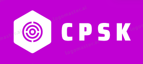

<div align="center">
  
</div>

# Competitive Programming Starters Kit
A tool for bootstrapping  boilerplate code in Competitive Programming Contests as fast as possible

[](https://github.com/Razdeep/Competitive-Programming-Starters-Kit/blob/master/LICENSE)
[](https://github.com/Razdeep/Competitive-Programming-Starters-Kit/stargazers)
[](https://github.com/Razdeep/Competitive-Programming-Starters-Kit/issues)
[](https://github.com/Razdeep/Competitive-Programming-Starters-Kit/network)
[](http://hits.dwyl.io/Razdeep/Competitive-Programming-Starters-Kit)

## Dependencies
 - g++
 - clang-format
 - cmake

## Building & Installing from source
 - Open terminal and navigate to your working directory.
 - Run the following commands
 ```bash
 $ git clone https://github.com/razdeep/Competitive-Programming-Starters-Kit.git
 $ cd Competitive-Programming-Starters-Kit
 $ mkdir build && cd build
 $ cmake .. && cmake --build .
 $ sudo make install
 ```

## Building in Docker
 - Install docker from [here](https://www.docker.com/get-started)
 - Navigate to the project root directory
 - Build the docker image by running the command
 ```bash
 $ docker build -t cpsk .
 ```
 - Run the docker image
 ```bash
 $ docker run -v $PWD:/app -it cpsk
 ```
 - The rest of the steps are similar to whatever mentioned above.
 
## How to use
1. Make sure you have installed CPSK. You can verify your installation by running the command `cpsk --version`.
2. Generate the source files by running the command `cpsk <FILENAME>`.
3. Open the generated source file using your favourite text editor e.g. `vim <FILENAME>`.


## Supported Platforms
 - Linux
 - Mac Os 
 - Windows

## License
Licensed under the Apache License, Version 2.0 (the "License");
you may not use this file except in compliance with the License.
You may obtain a copy of the License at

[http://www.apache.org/licenses/LICENSE-2.0](http://www.apache.org/licenses/LICENSE-2.0)

Unless required by applicable law or agreed to in writing, software
distributed under the License is distributed on an "AS IS" BASIS,
WITHOUT WARRANTIES OR CONDITIONS OF ANY KIND, either express or implied.
See the License for the specific language governing permissions and
limitations under the License.

**Copyright 2019 Rajdeep Roy Chowdhury**